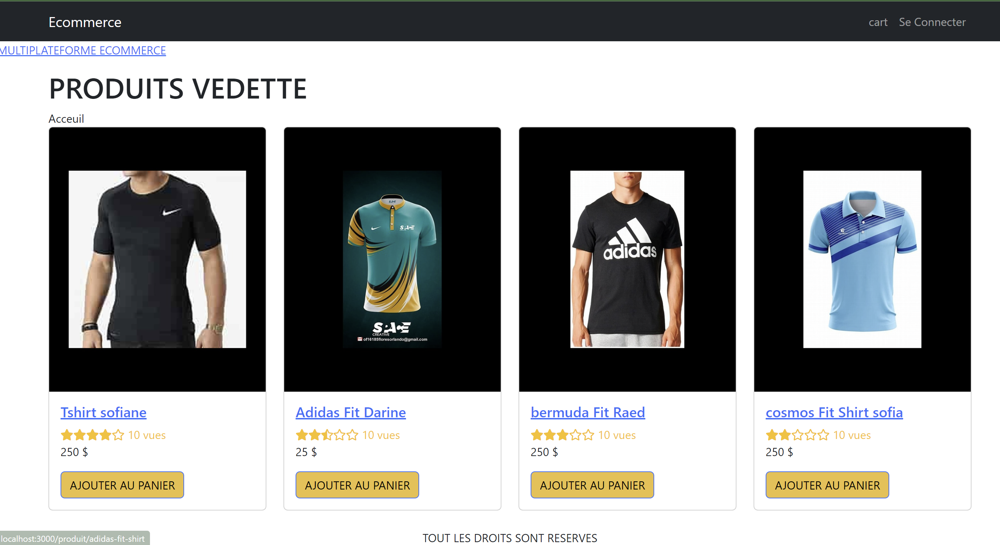

###  pré-requis a connaitre
* HTML5 et CSS3 : éléments sémantiques, grille CSS, Flexbox
* React : Composants, Props, Événements, Hooks,  Routeur,     Axios
* API de contexte : Store, Réducers, Actions
* Node & Express : API Web, analyseur de corps, téléchargement de fichiers, JWT
* MongoDB : Mongoose, Agrégation
* Développement : ESLint, Babel, Git, Github,
* Déploiement : Heroku

## Exécuter localement

### 1. Cloner le dépôt
git clone https://github.com/Bsofiane1975/SofianEcom.git

### 2. Créer un fichier .env

- dupliquez .env.example dans le dossier server et renommez-le en .env
  
### 3. Configurer MongoDB
- MongoDB locale
  - Installez-le depuis [ici](https://www.mongodb.com/try/download/community)
  - Dans le fichier .env, mettez à jour MONGODB_URI=mongodb://localhost/amazona
- OU Atlas Cloud MongoDB
  - Créez une base de données sur [https://cloud.mongodb.com](https://cloud.mongodb.com)
  - Dans le fichier .env, mettez à jour MONGODB_URI=mongodb+srv://your-db-connection

### 4. Exécuter le back-end

```
$ cd server
$ npm install
$ npm start
```

### 5. Exécutez le frontend

```
# ouvrir un nouveau terminal
$ interface cd
$ npm install
$ npm start
```

### 6. Utilisateurs et produits 

- Exécutez ceci sur le navigateur : http://localhost:5000/api/seed
- Il renvoie l'e-mail et le mot de passe de l'administrateur ainsi que 4 exemples de produits

### 7. Connexion administrateur

- Exécutez http://localhost:3000/connect
- Entrez l'e-mail et le mot de passe de l'administrateur et cliquez sur Connexion

## Soutien

- Contacter l'instructeur : [boumaiza sofiane](mailto:boumaizas75@gmail.com)

# Leçons

1. Introduction
2. Installer les outils
3. Créer une application React
4. Créer un référentiel Git
5. Liste des produits
   1. créer une gamme de produits
   2. ajouter des images de produits
   3. rendre les produits
   4. produits de style
6. Ajouter un routage de pages
   1. npm je react-routeur-dom
   2. créer un itinéraire pour l'écran d'accueil
   3. créer un routeur pour l'écran du produit
7. Créer un serveur Node.JS
   1. exécutez npm init dans le dossier racine
   2. Mettre à jour le type d'ensemble package.json : module
   3. Ajoutez .js aux importations
   4. npm install express
   5. créer serveur.js
   6. ajoutez la commande start en tant que node backend/server.js
   7. exiger express
   8. Créer une route pour/retourner le backend est prêt.
   9. déplacer produits.js du frontend vers le backend
   10. créer une route pour /api/produits
   
   
